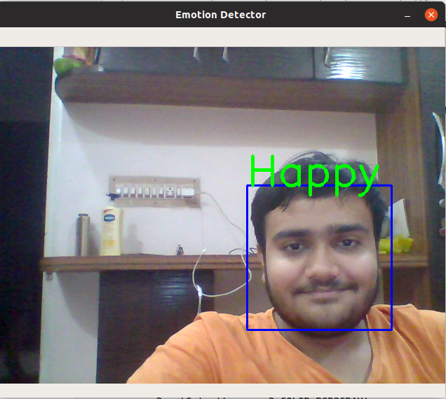
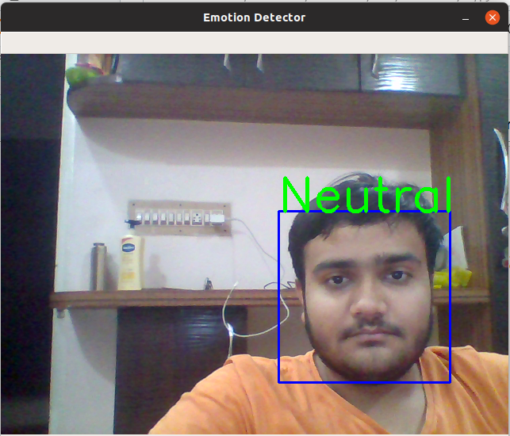
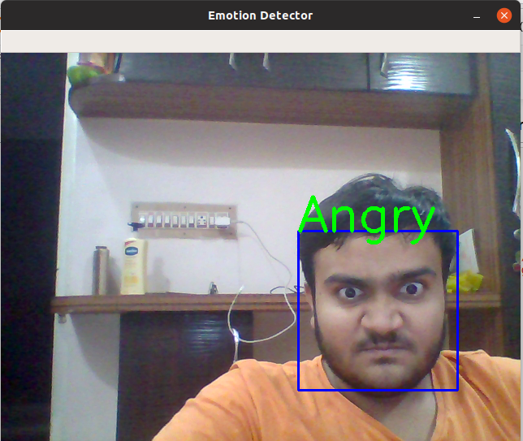
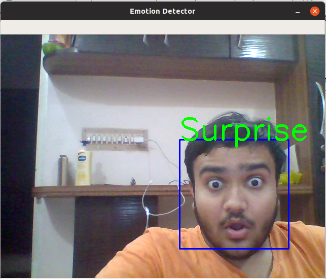

# Human_face_expression_recognition
******************************************************************************************************************************
This project aims on detecting human faces expressions
******************************************************************************************************************************
Attachments
______________________________________________________________________________________________________________________________
1.Emotion_little_vgg.h5
-->this file is the pre-trained model if you want you can use it directly
2.Human_expression_recognition.ipynb
-->this file is the jupyter notebook for training the model
3.Human_expression_recognition_2.ipynb
-->this file is the jupyter notebook for opencv implementation of the model
4.Haarcascade_frontalface_default.xml
-->This is the model of opencv for the face recognition
_____________________________________________________________________________________________________________________________
examples

_______________________________________________________HAPPYFACE_____________________________________________________________

_______________________________________________________NEUTRALFACE___________________________________________________________

_______________________________________________________AGNGRYFACE____________________________________________________________

______________________________________________________SURPRISEDFACE__________________________________________________________

NOTE:- I have not uploaded the sad face image as it was not giving accurate results
